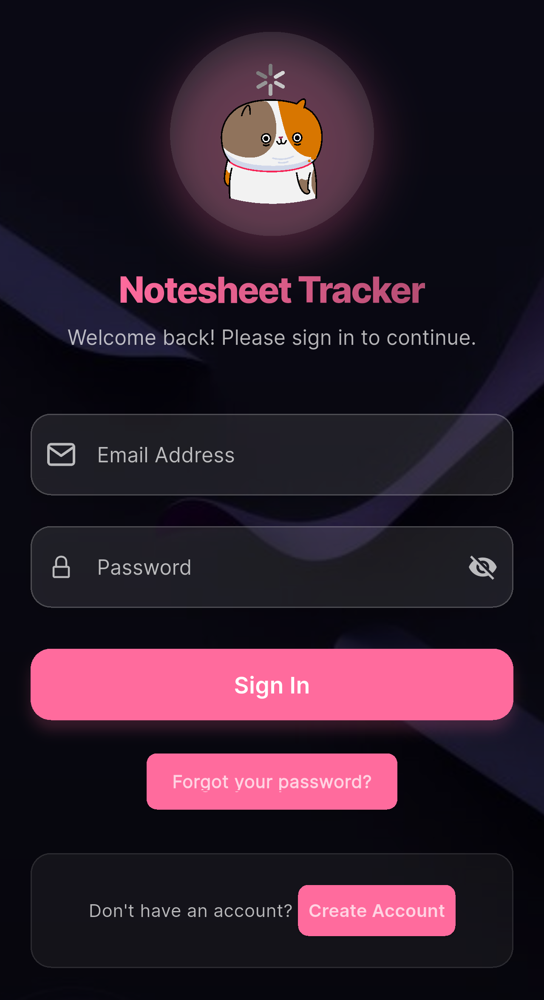

# Trackademia



A modern and intuitive notesheet management system designed to streamline the submission, review, and approval process for students, faculty, and HODs. Built with Flutter for a beautiful cross-platform experience and powered by Supabase for a robust backend.

## 🌟 Features

- **User Authentication:** Secure sign-up, sign-in, and role-based access (Student, Faculty, HOD).
- **Notesheet Submission:** Students can easily upload and track their notesheets.
- **Role-Based Dashboards:** Tailored dashboards for students, faculty, and HODs displaying relevant information and actions.
- **Faculty Review:** Faculty members can review, approve, reject, or request revisions on submitted notesheets.
- **HOD Approval:** HODs can make final decisions on faculty-approved notesheets.
- **Status Tracking:** Comprehensive status updates and history for each notesheet.
- **Notifications:** Real-time notifications for status changes and important updates.
- **Profile Management:** Users can view and edit their personal profiles.

## 🚀 Technologies Used

- **Frontend:**
  - [Flutter](https://flutter.dev/) - UI Toolkit for building natively compiled applications for mobile, web, and desktop from a single codebase.
  - [Riverpod](https://riverpod.dev/) - A complete, testable, and type-safe data-binding and caching framework for Flutter.
  - [GoRouter](https://pub.dev/packages/go_router) - Declarative routing package for Flutter.
  - [Lottie](https://pub.dev/packages/lottie) - For beautiful animations.
  - [Flutter SVG](https://pub.dev/packages/flutter_svg) - For SVG asset rendering.
  - [Convex Bottom Bar](https://pub.dev/packages/convex_bottom_bar) - For elegant bottom navigation.
  - [Flutter Staggered Animations](https://pub.dev/packages/flutter_staggered_animations) - For smooth list animations.
  - [UUID](https://pub.dev/packages/uuid) - For generating unique identifiers.
- **Backend:**
  - [Supabase](https://supabase.io/) - An open-source Firebase alternative providing a PostgreSQL database, Authentication, instant APIs, and Storage.
  - [PostgreSQL](https://www.postgresql.org/) - Relational database.

## 🛠️ Getting Started

Follow these steps to get your development environment set up and run the application.

### Prerequisites

- [Flutter SDK](https://flutter.dev/docs/get-started/install) (Stable Channel recommended)
- [Git](https://git-scm.com/book/en/v2/Getting-Started-Installing-Git)
- [Supabase Account](https://supabase.io/dashboard)
- [Supabase CLI](https://supabase.io/docs/guides/cli) (Optional, but recommended for local development)

### Installation

1.  **Clone the repository:**

    ```bash
    git clone https://github.com/your-username/notesheet_tracker.git
    cd notesheet_tracker
    ```

2.  **Install Flutter dependencies:**
    ```bash
    flutter pub get
    ```

### Supabase Setup

This project relies heavily on Supabase for its backend. You'll need to set up your Supabase project, database schema, and Row Level Security (RLS) policies.

1.  **Create a new Supabase Project:**

    - Go to the [Supabase Dashboard](https://supabase.io/dashboard).
    - Click "New project" and follow the instructions. Note your Project URL and Anon Key.

2.  **Configure Supabase in your Flutter App:**

    - Open `lib/main.dart`.
    - Replace `YOUR_SUPABASE_URL` and `YOUR_SUPABASE_ANON_KEY` with your actual Project URL and Anon Key from the Supabase Dashboard.

    ```dart
    await Supabase.initialize(
      url: 'YOUR_SUPABASE_URL',
      anonKey: 'YOUR_SUPABASE_ANON_KEY',
    );
    ```

3.  **Database Schema & RLS Policies:**

    - The entire database schema and RLS policies are defined in the `supabase_rls_policies.txt` file in the project root.
    - **Important:** Before applying, ensure you have **deleted all existing RLS policies** from your Supabase project for the `profiles`, `notesheets`, `reviews`, `status_history`, `notesheet_comments`, and `notifications` tables.
    - Go to your Supabase Dashboard -> **SQL Editor**.
    - Copy the entire content of `supabase_rls_policies.txt` and paste it into the SQL Editor.
    - Run the query. This will create all necessary tables, columns, and RLS policies.

4.  **Auth Hooks (Custom JWT Claims):**

    - This project uses custom JWT claims to embed user roles directly into the authentication token, which is crucial for RLS.
    - Ensure the `custom_claims` function is created in your database (it's included in `supabase_rls_policies.txt`).
    - Go to your Supabase Dashboard -> **Authentication** -> **Auth Hooks (BETA)**.
    - Click "New Hook".
    - **Hook Type:** `Postgres`
    - **Postgres Schema:** `public`
    - **Postgres Function:** Select `custom_claims` from the dropdown.
    - Save the hook.

5.  **Grant Permissions for Auth Hook:**
    - The `custom_claims` function needs permission to read from the `profiles` table.
    - Go to your Supabase Dashboard -> **SQL Editor**.
    - Run the following command:
      ```sql
      GRANT SELECT ON public.profiles TO supabase_auth_admin;
      ```

### Running the App

1.  **Connect a device or start an emulator.**
2.  **Run the application:**
    ```bash
    flutter run
    ```

## 📂 Project Structure

The core application logic resides in the `lib` directory:

```
lib/
├── core/             # Core functionalities: routing, themes, constants, utilities
├── models/           # Data models for notesheets, users, reviews, etc.
├── providers/        # Riverpod providers for state management and data fetching
├── screens/          # UI screens for different parts of the application (auth, dashboard, profiles, submissions)
│   ├── auth/
│   ├── dashboard/
│   ├── faculty/
│   ├── hod/
│   ├── profile/
│   ├── student/
│   ├── submissions/
│   └── upload/
├── services/         # Services for interacting with Supabase (Auth, Notesheet, Profile, Review, Notification)
├── widgets/          # Reusable UI widgets
│   ├── animations/
│   ├── cards/
│   ├── common/
│   ├── faculty/
│   ├── hod/
│   ├── navigation/
│   └── shared/
└── main.dart         # Main entry point of the Flutter application
```

## 🤝 Contributing

Contributions are welcome! If you have suggestions, bug reports, or want to contribute code, please feel free to open an issue or submit a pull request.

## 📄 License

This project is licensed under the MIT License - see the [LICENSE](LICENSE) file for details.

---

Made with ❤️ by Sajal Kanwal
